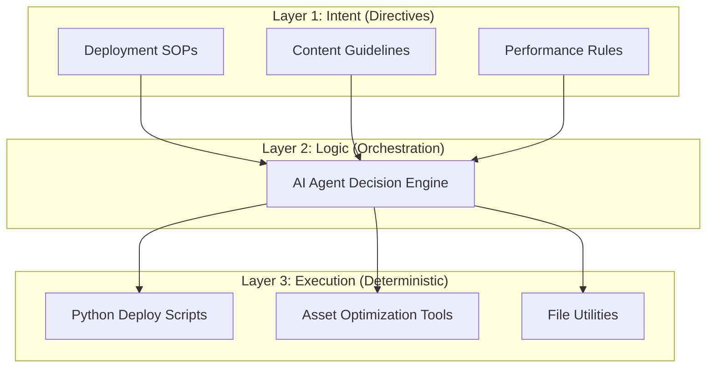

# 🚀 Burak Studio

### Premium AI-Native Digital Flagship


> **Elevating modern web presence through state-of-the-art design and deterministic orchestration.**

Burak Studio is a high-fidelity digital ecosystem that merges **luxury aesthetics** with **agentic automation**. It serves as a technical showcase for 3rd-generation UI techniques and a robust 3-layer architecture designed for multi-agent collaboration.

---

## 💎 The "Ultimate UI" Core

This project utilizes a customized design system focused on visual depth, tactile feedback, and hardware-accelerated motion.

### 🎨 Aesthetic Pillars

- **Liquid Mesh Gradient**: A sophisticated "midnight" background system using synchronized radial gradients with a flowing mesh animation.
- **Glassmorphic fragments**: Dynamically generated geometric shapes that float and rotate based on scroll depth, creating a 3D parallax environment.
- **Luxury Noise Texture**: A refined `soft-light` noise overlay that provides a premium analog grain to digital surfaces.
- **High-End Glassmorphism 2.0**: Advanced backdrop blurs featuring **Dynamic Border Glows** that track the cursor position around the card's perimeter.

### ⚡ Interactive Micro-animations

- **Dual-Layer Cursor Glow**: A specialized hardware-accelerated lighting system that provides smooth, high-fidelity cursor tracking with an atmospheric pulse.
- **Magnetic Navigation**: Elements feature a localized magnetic field that pulls towards the cursor for high-intent interactivity.
- **3D Card Dynamics**: Real-time perspective transforms combined with rotational border lighting for a tangible physical presence.
- **Kinetic Typography**: Glitch-animated and gradient-masked headings that respond to hover states.

---

## 🤖 3-Layer Agentic Architecture

The project is built around a scalable, modular architecture that separates human intent from deterministic execution.



### 📂 Structural Breakdown

- **[Directives](./directives/)**: Markdown-based Standard Operating Procedures (SOPs).
- **Orchestration**: The routing layer where business logic meets agentic reasoning.
- **[Execution](./execution/)**: A suite of deterministic Python scripts for reliable operations.

---

## 🛠 Technical Specification

### 💻 Frontend Stack

- **Structure**: Semantic HTML5 with a focus on accessibility and SEO.
- **Styling**: Modern CSS3 utilizing Custom Properties, `mix-blend-mode`, and 3D Transforms.
- **Logic**: Vanilla JavaScript Optimized for 60fps performance through debouncing and GPU acceleration.

### 🐍 Automation Suite

- **Core**: Python 3.10+
- **Libraries**: `python-dotenv` for environment management.
- **Tools**: Custom-built optimization and deployment engines.

### 🛡 Security & Hygiene

- **Protection**: Production-grade `.gitignore` protecting all environment secrets and local clutter.
- **Portability**: Optimized relative path structure for seamless repository cloning and deployment.

---

## 🏁 Running the Project

### 1. Live Preview (Local Server)

For the full "Ultimate UI" experience, it is recommended to run the project via a local development server.

```bash
# Option A: Python (Fastest)
python -m http.server 8000

# Option B: Node.js
npx serve .
```

Then visit `http://localhost:8000` in your browser.

### 2. Automation Suite

The project includes a robust execution layer for high-level operations.

```bash
# Initialize automation environment
pip install -r requirements.txt

# Execute a performance/asset audit
python execution/optimize_assets.py --dry-run

# Trigger the deployment engine
python execution/deploy_website.py --platform github
```

---

> [!IMPORTANT] > **Performance Architecture:** All animations are bound to `transform` and `opacity` properties to ensure zero layout-thrashing and maximum battery efficiency on mobile devices.

**Documented by [Burak Studio Architecture team].**
