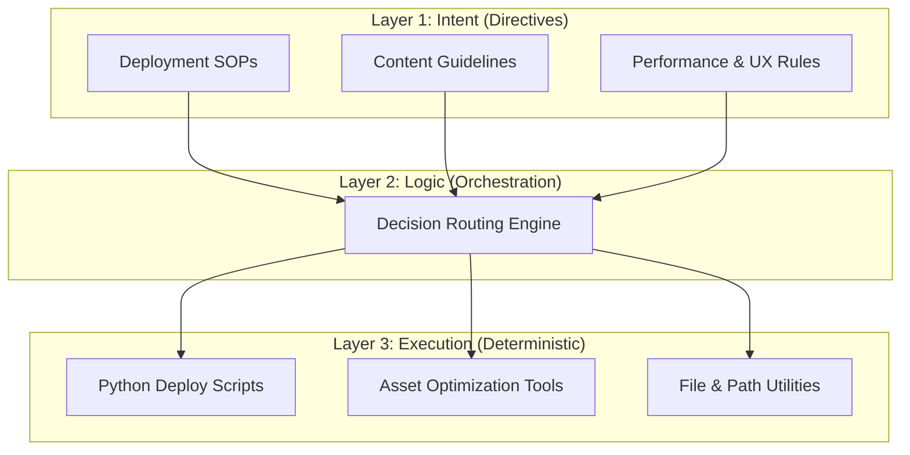

# 🚀 Burak Studio  
### Premium AI-Native Digital Flagship  


> **Elevating modern web presence through state-of-the-art design and deterministic orchestration.**

**Burak Studio** is an experimental, high-fidelity digital showcase that explores the convergence of luxury-grade UI design and structured, scalable automation. Built as a living prototype, it demonstrates how advanced front-end techniques can be paired with a disciplined architectural approach to create immersive, performant, and maintainable web experiences.

Live Demo: [https://abir994.github.io/Burak-Studio/](https://abir994.github.io/Burak-Studio/)

---

## 💎 The "Ultimate UI" Core

This project implements a custom design system engineered for **depth**, **motion**, and **sensory richness**—all while maintaining strict performance discipline.

### 🎨 Aesthetic Pillars

- **Liquid Mesh Gradient**: A dynamic “midnight” backdrop formed by synchronized radial gradients and a flowing SVG mesh that animates fluidly in the background.
- **Glassmorphic Fragments**: Procedurally generated translucent geometric shards that float, rotate, and shift based on scroll depth—creating a layered 3D parallax field.
- **Luxury Noise Texture**: A subtle analog-style grain applied via `mix-blend-mode: soft-light` to evoke premium tactile surfaces in a digital context.
- **Glassmorphism 2.0**: Frosted-glass UI cards enhanced with **dynamic border glows** that react to cursor proximity, simulating real-world light reflection.

### ⚡ Interactive Micro-Animations

- **Dual-Layer Cursor Glow**: A GPU-accelerated lighting effect with a core highlight and atmospheric halo that tracks movement with cinematic smoothness.
- **Magnetic Navigation**: Interactive elements gently attract toward the cursor within a defined radius, signaling affordance without visual noise.
- **3D Card Dynamics**: Cards respond to hover with real-time perspective transforms (`rotateX`, `rotateY`) and directional emissive borders for physicality.
- **Kinetic Typography**: Headings use gradient masks, glitch transitions, and motion-triggered reveals—crafted to feel responsive yet refined.

> ✅ All animations exclusively use `transform` and `opacity` to ensure **60fps performance**, **zero layout thrashing**, and **battery-efficient mobile rendering**.

---

## 🤖 3-Layer Architecture

Burak Studio is structured around a clear separation between **intent**, **coordination**, and **execution**—enabling reproducibility, modularity, and future extensibility.



### 📂 Structural Breakdown

- **[`/directives`](./directives/)**: Human-authored Markdown files defining *what* should happen (e.g., “All images must be under 100KB”).
- **Orchestration Layer**: Interprets directives and selects appropriate execution paths based on context.
- **[`/execution`](./execution/)**: Idempotent Python scripts that perform concrete tasks—ensuring consistent, repeatable outcomes.

This architecture supports **declarative development**: specify desired outcomes, not implementation details.

---

## 🛠 Technical Specification

### 💻 Frontend Stack

- **Markup**: Semantic HTML5 with full accessibility (ARIA) and SEO considerations.
- **Styling**: Pure CSS3 using:
  - CSS Custom Properties for theming
  - `backdrop-filter`, `clip-path`, and `mix-blend-mode`
  - Hardware-accelerated 3D transforms (`transform-style: preserve-3d`)
- **Behavior**: Vanilla JavaScript (no frameworks) optimized for:
  - Scroll-linked animations via `requestAnimationFrame`
  - Debounced event handlers
  - Efficient DOM interaction

### 🐍 Automation Suite

- **Runtime**: Python 3.10+
- **Key Libraries**: `python-dotenv`, `Pillow` (for image processing)
- **Capabilities**:
  - Asset compression & format conversion
  - Build validation
  - One-command deployment

### 🛡 Security & Portability

- **No Secrets Leaked**: Comprehensive `.gitignore` excludes all local configs and caches.
- **Zero External Dependencies**: No CDNs, trackers, or third-party scripts—entirely self-contained.
- **Path-Agnostic Design**: Works identically from any directory due to relative path resolution.

---

## 🏁 Running the Project

### 1. Live Preview (Local Server)

For the full "Ultimate UI" experience, it is recommended to run the project via a local development server.

```bash
# Option A: Python (Fastest)
python -m http.server 8000

# Option B: Node.js
npx serve .
```

Then visit `http://localhost:8000` in your browser.

### 2. Automation Suite

The project includes a robust execution layer for high-level operations.

```bash
# Initialize automation environment
pip install -r requirements.txt

# Execute a performance/asset audit
python execution/optimize_assets.py --dry-run

# Trigger the deployment engine
python execution/deploy_website.py --platform github
```

---

## 🧑‍💻 Developed By

**ABiR994** using **Antigravity**.

---


