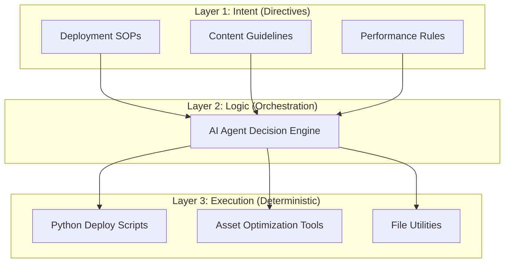

# 🚀 Burak Studio

### Premium AI-Native Digital Flagship


> **Elevating modern web presence through state-of-the-art design and deterministic orchestration.**

Burak Studio is a high-fidelity digital ecosystem that merges **luxury aesthetics** with **agentic automation**. It serves as a technical showcase for 3rd-generation UI techniques and a robust 3-layer architecture designed for multi-agent collaboration.

---

## 💎 The "Ultimate UI" Core

This project utilizes a customized design system focused on visual depth, tactile feedback, and hardware-accelerated motion.

### 🎨 Aesthetic Pillars

- **Luxury Noise Texture**: A custom overlay providing a sophisticated grain that breaks digital flatnesses.
- **Dynamic Oracles**: Pulsing, reactive background glows (Purple, Green, Blue) that respond to page state.
- **High-End Glassmorphism**: High-performance backdrop blurs with precision gradient border glows.
- **Atmospheric Illumination**: A soft radial gradient focus that provides a premium interactive presence.

### ⚡ Interactive Micro-animations

- **Magnetic Navigation**: Elements feature a localized magnetic field that pulls towards the cursor.
- **3D Card Dynamics**: Real-time perspective transforms providing a tangible physical presence.
- **Adaptive Shine**: Simulated light reflections that track cursor velocity and position.
- **Progress Tracking**: A hardware-accelerated gradient tracker integrated into the global navigation.

---

## 🤖 3-Layer Agentic Architecture

The project is built around a scalable, modular architecture that separates human intent from deterministic execution.



### 📂 Structural Breakdown

- **[Directives](./directives/)**: Markdown-based Standard Operating Procedures (SOPs).
- **Orchestration**: The routing layer where business logic meets agentic reasoning.
- **[Execution](./execution/)**: A suite of deterministic Python scripts for reliable operations.

---

## 🛠 Technical Specification

### 💻 Frontend Stack

- **Structure**: Semantic HTML5 with a focus on accessibility and SEO.
- **Styling**: Modern CSS3 utilizing Custom Properties, `mix-blend-mode`, and 3D Transforms.
- **Logic**: Vanilla JavaScript Optimized for 60fps performance through debouncing and GPU acceleration.

### 🐍 Automation Suite

- **Core**: Python 3.10+
- **Libraries**: `python-dotenv` for environment management.
- **Tools**: Custom-built optimization and deployment engines.

### 🛡 Security & Hygiene

- **Protection**: Production-grade `.gitignore` protecting all environment secrets and local clutter.
- **Portability**: Optimized relative path structure for seamless repository cloning and deployment.

---

## 🚀 Deployment & Operations

### 1. Environment Setup

```bash
# Initialize local environment
pip install -r requirements.txt
```

### 2. Performance Audit

```bash
# Run the deterministic asset audit
python execution/optimize_assets.py --dry-run
```

### 3. Automated Deployment

```bash
# Execute multi-platform deployment
python execution/deploy_website.py --platform github
```

---

> [!IMPORTANT] > **Performance Architecture:** All animations are bound to `transform` and `opacity` properties to ensure zero layout-thrashing and maximum battery efficiency on mobile devices.

**Documented by [Burak Studio Architecture team].**
